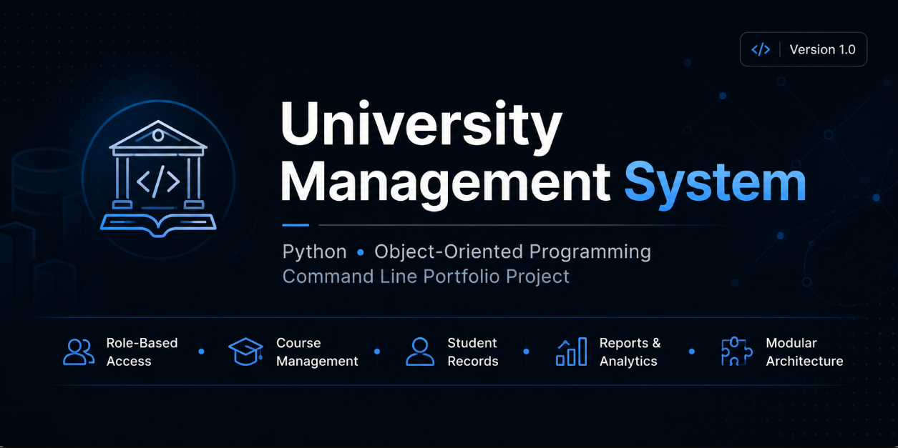

<p align="center">
  
</p>

<p align="center">


</p>

<h1 align="center">University Management System</h1>

<p align="center">
A Python-based role-oriented University Management System built using Object-Oriented Programming principles.<br>
Originally developed as a university assignment and now being continuously refactored into a professional software engineering portfolio project.
</p>

---

# 📖 Table of Contents

- Overview
- Tech Stack
- Project Status
- Why This Project?
- Features
- Project Structure
- Installation
- Usage
- Architecture
- Current Progress
- Roadmap
- Future Vision
- Screenshots
- Acknowledgements
- License
- Author

---

# 📚 Overview

University Management System is a command-line application developed using Python and Object-Oriented Programming principles.

The application simulates how different departments within a university interact through a centralized management system.

Different users are assigned different permissions based on their role, demonstrating concepts such as role-based access control, modular programming, and clean software architecture.

This repository is continuously being improved by applying modern software engineering practices including:

- Modular architecture
- Code refactoring
- Version control with Git
- Documentation
- Clean code principles
- Maintainability
- Continuous improvement

---

# 🛠 Tech Stack

| Technology | Purpose |
|------------|---------|
| Python | Core Programming Language |
| Object-Oriented Programming | Software Design |
| Git | Version Control |
| GitHub | Repository Hosting |
| Text Files | Data Storage |

---

# 🚧 Project Status

This repository is currently under active development.

The original university assignment is being transformed into a production-quality portfolio project by continuously improving:

- Project Architecture
- Code Quality
- Documentation
- Maintainability
- Git Workflow
- Software Design

---

# 🎯 Why This Project?

This project is more than a university assignment.

Its purpose is to demonstrate professional software engineering practices while continuously improving an existing codebase.

The repository focuses on:

- Object-Oriented Programming
- Modular Programming
- Clean Architecture
- Git Version Control
- Documentation
- Refactoring
- Maintainable Code

Every commit represents a meaningful improvement toward production-quality software.

---

# ✨ Features

## 👨‍💼 Administrator

- Add Courses
- Edit Courses
- Remove Courses
- Manage Students
- Manage Lecturers
- Manage Modules
- Generate Reports
- View All Data

---

## 📝 Registrar

- Register Students
- Manage Student Enrollments

---

## 👨‍🏫 Lecturer

- View Assigned Modules
- Enter Student Marks

---

## 🎓 Student

- View Personal Information
- View Registered Modules
- View Academic Results

---

## 💰 Accountant

- Fee Management

---

# 📁 Project Structure

```text
University-Management-System
│
├── assets/
│   └── banner.png
│
├── data/
│
├── docs/
│
├── screenshots/
│
├── src/
│   ├── main.py
│   ├── utils.py
│   └── ...
│
├── tests/
│
├── README.md
├── LICENSE
├── requirements.txt
└── .gitignore
```

---

# 🚀 Installation

Clone the repository

```bash
git clone https://github.com/abaanurrahman123-lgtm/University-Management-System.git
```

Navigate into the project

```bash
cd University-Management-System
```

Install dependencies

```bash
pip install -r requirements.txt
```

Run the application

```bash
python src/main.py
```

---

# 💻 Usage

Launch the application and choose one of the available roles.

- Administrator
- Registrar
- Lecturer
- Student
- Accountant

Each role provides its own menu and permissions within the system.

---

# 🏗 Architecture

The project follows a modular architecture.

```text
                User
                 │
                 ▼
            Main Menu
                 │
     ┌───────────┼───────────┐
     │           │           │
Administrator Registrar Accountant
     │
 Lecturer
     │
 Student
     │
 Utility Functions
     │
 Data Storage
```

---

# 📈 Current Progress

- ✅ Original university project completed
- ✅ Git version control integrated
- ✅ Professional GitHub repository created
- ✅ Utility functions extracted into a separate module
- ✅ Project restructuring started
- 🔄 Code refactoring in progress
- ⏳ Documentation improvements
- ⏳ Testing implementation

---

# 🛣 Roadmap

- [x] Initial University Project
- [x] Git Version Control
- [x] Professional Repository Setup
- [x] Utility Module Extraction
- [x] Initial Documentation
- [ ] Modular Refactoring
- [ ] Complete Documentation
- [ ] Unit Testing
- [ ] Better Error Handling
- [ ] Configuration Files
- [ ] Database Integration
- [ ] GUI Version
- [ ] REST API
- [ ] Docker Support
- [ ] Continuous Integration

---

# 🔮 Future Vision

The long-term goal is to transform this repository into a complete University Management System featuring:

- Database Support
- Authentication
- GUI Application
- REST API
- Automated Testing
- Continuous Integration
- Deployment Support
- Improved Security
- Better Performance
- Production-ready Architecture

---

# 📸 Screenshots

Application screenshots will be added as development progresses.

---

# 🙏 Acknowledgements

Originally developed as part of a university assignment.

Now maintained as a personal software engineering portfolio project focused on applying professional development practices.

---

# 📄 License

This project is licensed under the MIT License.

---

# 👨‍💻 Author

## Abaan Ur Rahman

Computer Engineering Student

Passionate about Software Engineering, Artificial Intelligence, and building professional portfolio projects.

GitHub:

https://github.com/abaanurrahman123-lgtm

---

# ⭐ Support

If you found this project useful, consider giving it a ⭐ on GitHub.

It helps support the project and motivates future development.